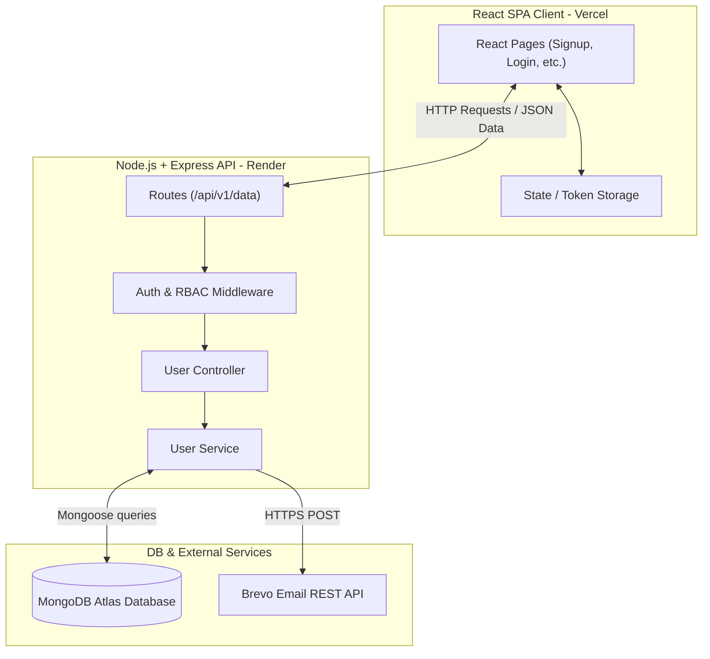
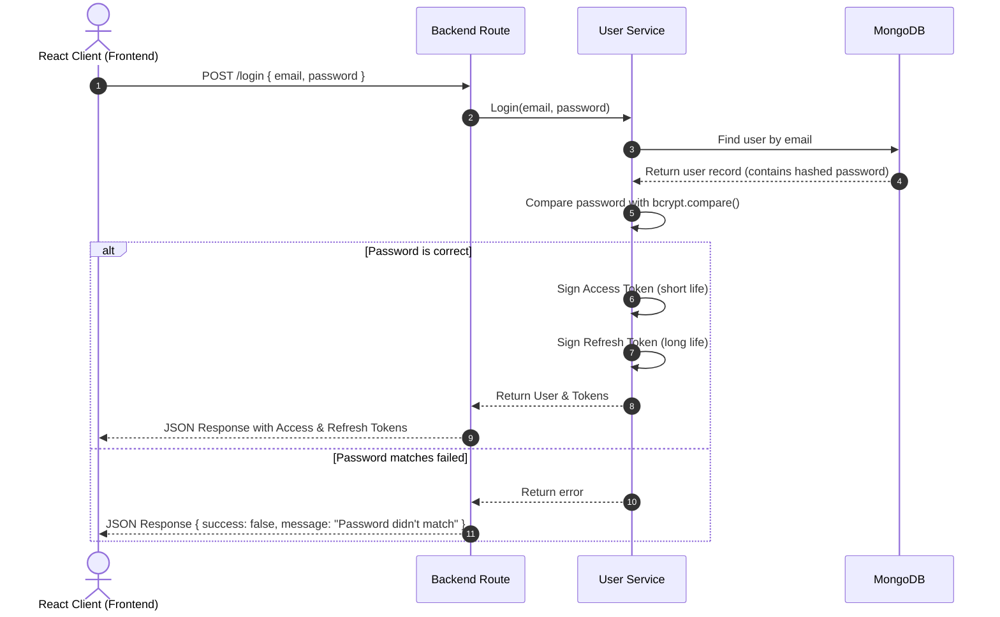
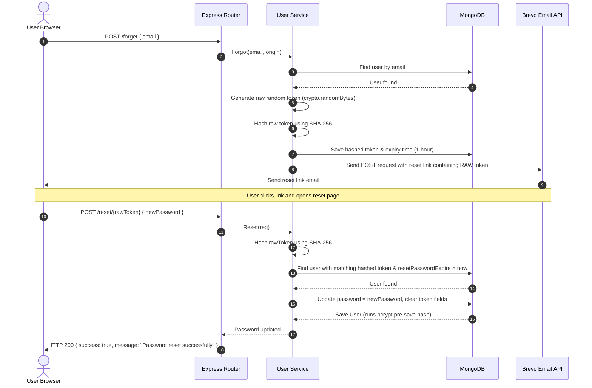

# High-Level Design (HLD) - AuthHub Project
**Author**: 2nd Year Kalvium Student Project Portfolio
**Topic**: High-Level System Architecture and Design Flows

---

## 1. Overall System Architecture
AuthHub uses a decoupled MERN stack architecture. The frontend React client is deployed on Vercel, and the backend Express server runs on Render, connecting to MongoDB Atlas.

Here is how the components interact:

---

## 2. Component Design & Roles

### 2.1 React Frontend SPA
*   **Built using**: Vite + React, React Router.
*   **Role**: Displays the pages, validates input forms (e.g. checking formatting before calling the backend), manages token status, and guides the user.

### 2.2 Express Backend Router & Controllers
*   **Built using**: Node.js, Express, `express-validator`.
*   **Role**: Exposes endpoints, coordinates business logic between routing rules and schemas, and handles response mapping.

### 2.3 User Service Layer
*   **Built using**: Node.js modules.
*   **Role**: Contains the actual algorithmic steps (e.g. verifying password hashes via `bcrypt.compare`, calling JWT signing libraries, and wrapping the email API helper).

### 2.4 Database (MongoDB Atlas)
*   **Built using**: MongoDB + Mongoose.
*   **Role**: Houses user collections, executes pre-save database triggers, and checks schemas.

---

## 3. Data Flow Sequences

### 3.1 Session Token Exchange (Login Flow)
This diagram shows how JWT credentials flow from the client to the server:

### 3.2 Security-Backed Password Recovery (Forgot/Reset Flow)
This diagram shows how the password reset token is saved and validated:

